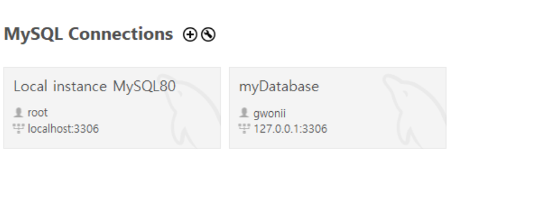
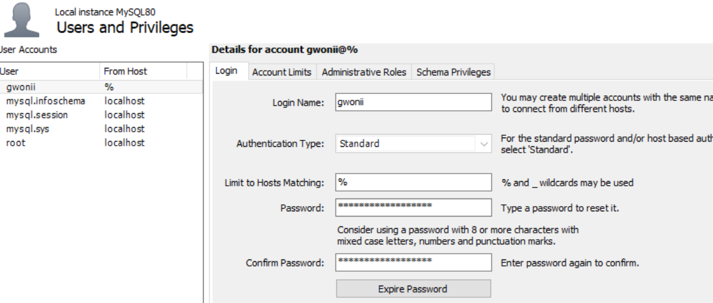
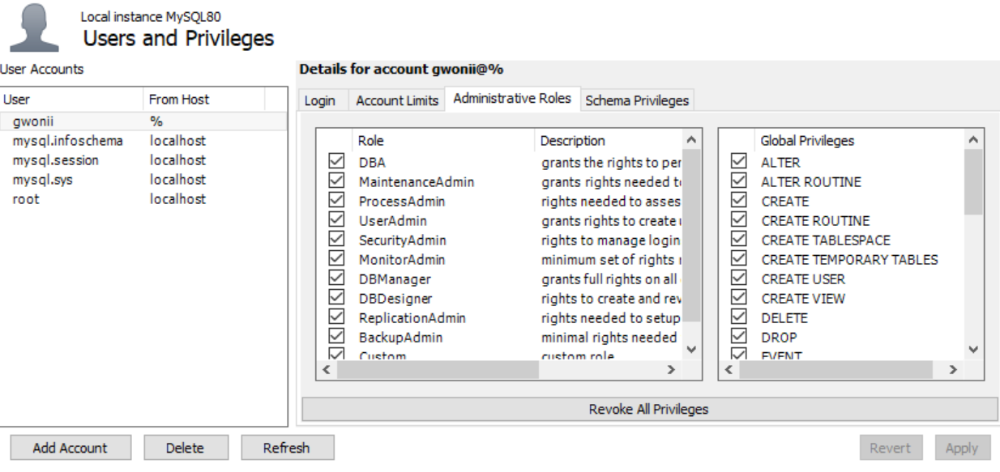
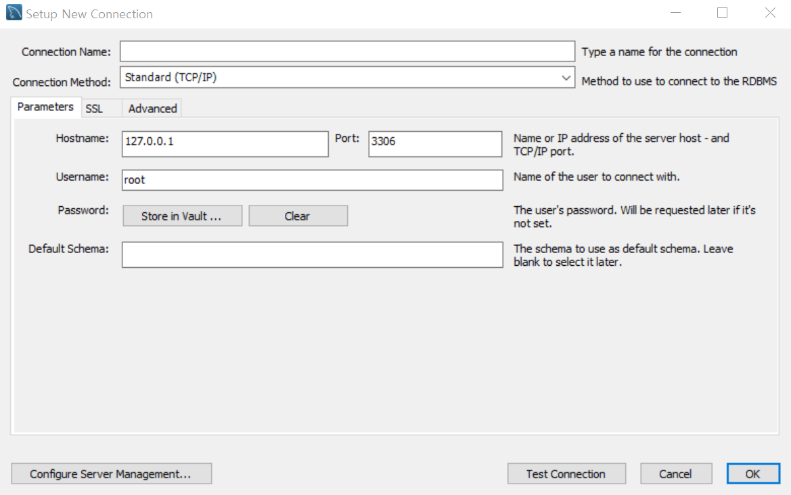
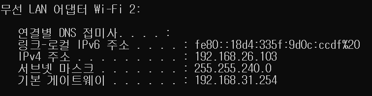

# MySQL 

## 초기 설정하기 

기본적으로 데이터베이스가 저장되어 있는 컴퓨터에는 내부적 or 외부적으로 접근할 수 있다. 오늘은 기본적인 설정과 내부적, 외부적 접근을 가능하게 하는 과정을 담으려고 한다. 

### 1. 데이터베이스 사용자 만들기 

1. 처음 MySQL에 들어가면 root계정을 생성하며 만들게 된다. 

그런데 여기서 하려고 하는 것은 데이터베이스 접근할 새로운유저를 만드는 것이다. 

2. 데이터베이스 접근할 새로운 유저를 추가한다. 

3. 그 후 Login에서 로그인 정보를 입력한다. 

4. Adminstrative Roles 의 권한 정보를 설정한다. ( 예제로 사용하는 것이기에 전체 권한 부여 )

### 2. 내부 연결 만들기 

1. home 화면에서 `+` 버튼을 누르고 새로운 Connection을 만든다.  
2. Connection의 이름을 설정한다. 
3. 내부로 연결하는 것이기 때문에 root local IP 주소인 127.0.0.1 을 써준다. 
4. Username에 이전에 만든 Username을 작성한다. 

### 3. 외부 연결 만들기 

내부 연결과 거의 동일하지만 `Hostname`을 Local IP 가 아닌 외부에 연결된 `Hostname`을 작성해준다. 

1. home 화면에서 `+` 버튼을 누르고 새로운 Connection을 만든다.  
2. Connection의 이름을 설정한다. 
3. 외부로 연결하는 것이기 때문에 IP 주소인 192.168.26.103 을 써준다.

전용 서버 컴퓨터가 아니기 때문에 정해진 IPv4 주소를 사용하지 않는다. 그렇기 때문에 어떤 IP에서도 접근할 수 있도록 여러 개 만들어 놓는 것이 좋을 수도 있겠다. (왠만하면 서버 컴퓨터는 움직이지 않겠지만,,,)  

4. Username에 이전에 만든 Username을 작성한다. 